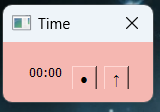
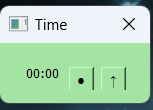
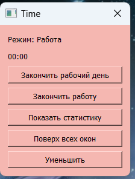
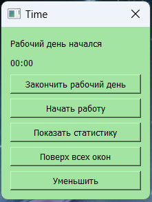
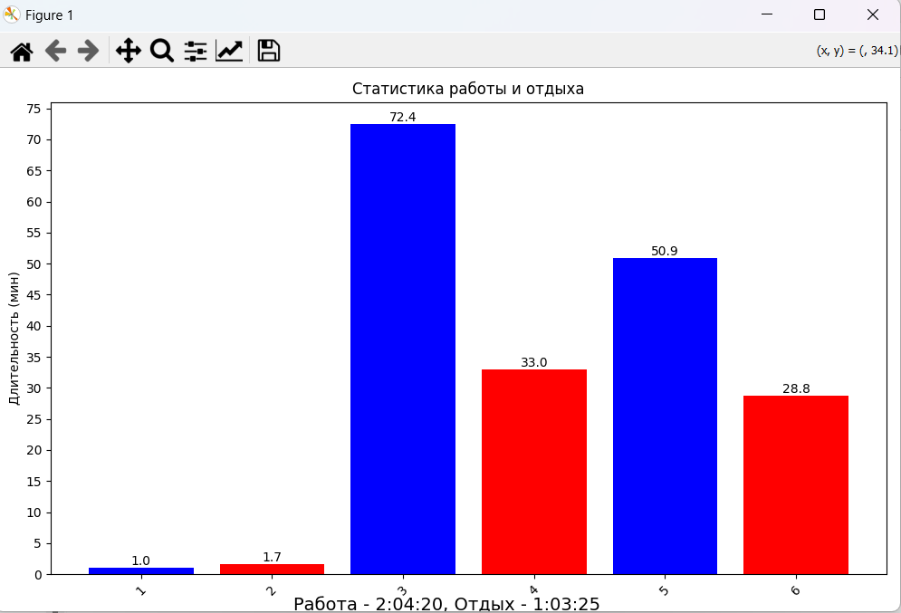

# Time Desk — Work/Rest Tracker for Windows

<div align="center">




**Desktop application for work time tracking that's always visible**

</div>

---

## 📋 About the Project

A simple and convenient time tracker created for **personal use** at work.

**Why not a mobile app?**  
When working at a computer, your phone is often busy (video, music), and it's easy to forget to press the pause or start button in a mobile tracker. Time Desk solves this problem — **a compact window is always in sight** on top of all applications, reminding you of your current work status.

---

## ✨ Features

- 🌗 **Two modes**: Work (red) / Rest (green)
- ⏱️ **Continuous time tracking** in each mode
- 🟢/🔴 **Visual indication** — window color shows current status
- 📌 **"Always on top"** — you always see whether you're working or resting
- 🧩 **Compact mode** — minimalist window (timer + buttons)
- 📊 **Daily statistics** — session chart with time details
- 💾 **Auto-save** — all sessions are saved between launches

---

## 📸 Screenshots

<table>
<tr>
<td width="50%">

### Work Mode


</td>
<td width="50%">

### Rest Mode


</td>
</tr>
<tr>
<td colspan="2">

### Daily Statistics


</td>
</tr>
</table>

---

## 📖 Usage

1. **Launch the application** — the window opens in "Start of day" mode. The window will be gray.
2. **Click "Start working day"** — Statistics and start work buttons appear. The timer hasn't started yet.
3. **Click "Work"** — work time tracking begins (window turns red)
4. **Click "Rest"** — switch to rest mode (window turns green)
5. **Switch modes** throughout the day — all sessions are automatically saved
6. **"Always on top" button** — pins the window on top of all applications. When clicked, its text changes to "Normal mode", allowing you to switch back.
7. **"Minimize" button** — collapses the window to compact mode.
8. **"↑" button** — expands the window to normal mode. Available when the window is minimized.
9. **"Show statistics" button** — opens a window with statistics for the current day
10. **"End working day" button** — resets daily statistics, the window becomes gray, and the buttons for statistics and work/rest mode switching disappear.

---

## 🚀 Installation and Launch

### Running from Source

```bash
# Clone the repository
git clone https://github.com/your-username/Fix_time_for_work.git
cd Fix_time_for_work

# Create a virtual environment
python -m venv .venv

# Activate the environment (Windows)
.venv\Scripts\activate

# Install dependencies
pip install -r requirements.txt

# Run the application
python main.py
```

### Building an Executable (.exe)

To create a standalone `.exe` file, PyInstaller is used:

```bash
# Install PyInstaller (if not already installed)
pip install pyinstaller

# Build the application
pyinstaller main.spec
```

The finished file will be located in the `dist/` folder.

## 📁 Project Structure

```
Fix_time_for_work/
│
├── main.py              # Main application code
├── main.spec            # PyInstaller configuration
├── styles.qss           # Interface styles (QSS)
├── sessions.json        # Session data (created automatically)
├── requirements.txt     # Python dependencies
│
├── assets/              # Screenshots for README
│   ├── compact_work.png
│   ├── compact_rest.png
│   ├── full_work.png
│   ├── full_rest.png
│   ├── stats.png
│   └── Start_day.png
│
└── ico.ico              # Application icon
```

## 👤 Author

Created for personal use and as a demonstration of PyQt5 skills.

**Status**: Actively used ✅  
**Testing**: On real daily work

---

<div align="center">

⭐ If the project was useful, give it a star!

</div>

